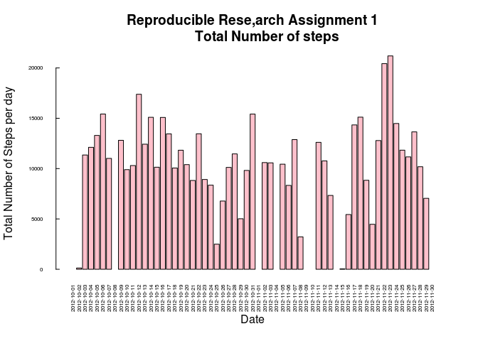
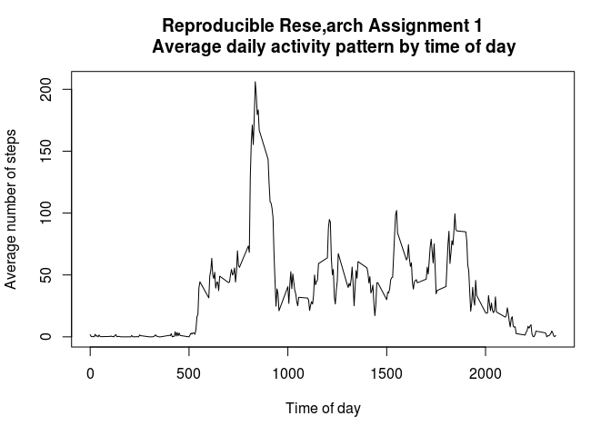
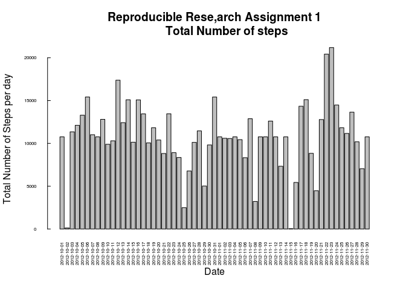
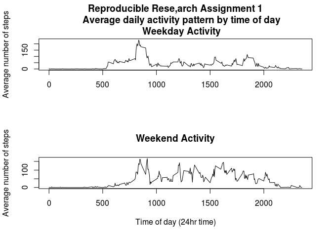

# Reproducible Research: Peer Assessment 1


Refers to my [GitHub account repository][1]

## Loading and preprocessing the data


```r
## read the data from disk
the_data <- read.csv("activity.csv")
## convert date variable to date class
the_data$date <- as.Date(the_data$date,"%Y-%m-%d")
```

## What is mean total number of steps taken per day?

For this part of the assignment, you can ignore the missing values in
the dataset.

1. Make a histogram of the total number of steps taken each day


```r
## create table of totals per day
total_steps <-  tapply(the_data$steps,the_data$date,sum)

## set parameters: x axis labels are vertical;
##     axis font is 50% size; tickmarks changed
par(las=2, cex.axis = 0.5, tcl = 0.25)

## create barplot
barplot(total_steps, 
        main = "Reproducible Rese,arch Assignment 1
        Total Number of steps",
        xlab = "Date",
        ylab = "Total Number of Steps per day",
        col = "pink"
        )
```

 

2. Calculate and report the **mean** and **median** total number of steps taken per day


```r
## calculate mean steps for all days with data
##NB: 4 of 61 days have no data which affects the mean.
mean_steps <-   mean(total_steps,na.rm = T)

print(mean_steps)
```

```
## [1] 10766.19
```

```r
## calculate median number of steps
median_steps <- median(total_steps,na.rm = T)

print(median_steps)
```

```
## [1] 10765
```

<span style="color: red;">The mean number of steps per day is 1.0766189\times 10^{4}. The median number of steps per day is 10765.</span>

## What is the average daily activity pattern?

1. Make a time series plot (i.e. `type = "l"`) of the 5-minute interval (x-axis) and the average number of steps taken, averaged across all days (y-axis)


```r
## create table of average steps taken by time interval
ts_m_i <- tapply(the_data$steps,the_data$interval,
                 function(x){mean(x, na.rm = T)})

## plot average steps by time interval
plot(names(ts_m_i),
     ts_m_i,
     type = 'l',
     main = "Reproducible Rese,arch Assignment 1
     Average daily activity pattern by time of day",
     xlab = "Time of day",
     ylab = "Average number of steps"
     )
```

 

2. Which 5-minute interval, on average across all the days in the dataset, contains the maximum number of steps?


```r
## subset the maximum value. This preserves the name corresponding to the value.
max_steps <- ts_m_i[ts_m_i == max(ts_m_i)]

## tidy up interval so that 835 becomes 0835
names(max_steps) <- gsub(names(max_steps),pattern = "(^[0-9][0-9][0-9]$)",replacement = "0\\1")
print(max_steps)
```

```
##     0835 
## 206.1698
```

<span style="color: red;">The maximum number of steps for any given 5-minute interval happens at 0835. The peak value is 206.1698113.</span>

## Imputing missing values

Note that there are a number of days/intervals where there are missing
values (coded as `NA`). The presence of missing days may introduce
bias into some calculations or summaries of the data.

1. Calculate and report the total number of missing values in the dataset (i.e. the total number of rows with `NA`s)


```r
## create logical vector of missing values and count them
missing_values <- sum(is.na(the_data$steps))

print(missing_values)
```

```
## [1] 2304
```

<span style="color: red;">The number of missing observations is 2304.</span>

2. Devise a strategy for filling in all of the missing values in the dataset. The strategy does not need to be sophisticated. For example, you could use the mean/median for that day, or the mean for that 5-minute interval, etc.


```r
## My strategy for filling in missing NA values in data set:
## 1. create table of lookups for average values per day (ts_m_i) calculated earlier
## 2. produce logical vector of missing values
##    the_data$steps[is.na(the_data$steps)]
## 3. create vector of values from ts_m_i which fill in missing values
## 4. fill in missing values with vector of values

## this can't be done with match function (AFAIK) because the array matches
## against the name of the value. Therefore the lookup treats values as
## characters and matches names
```

3. Create a new dataset that is equal to the original dataset but with the missing data filled in.


```r
## show data before NAs filled in
print(head(the_data))
```

```
##   steps       date interval
## 1    NA 2012-10-01        0
## 2    NA 2012-10-01        5
## 3    NA 2012-10-01       10
## 4    NA 2012-10-01       15
## 5    NA 2012-10-01       20
## 6    NA 2012-10-01       25
```

```r
## show average values for each time interval
print(head(ts_m_i))
```

```
##         0         5        10        15        20        25 
## 1.7169811 0.3396226 0.1320755 0.1509434 0.0754717 2.0943396
```

```r
the_data$steps[is.na(the_data$steps)] <- 
    ts_m_i[as.character(the_data[is.na(the_data$steps),3])]

## show data after NAs filled in
print(head(the_data))
```

```
##       steps       date interval
## 1 1.7169811 2012-10-01        0
## 2 0.3396226 2012-10-01        5
## 3 0.1320755 2012-10-01       10
## 4 0.1509434 2012-10-01       15
## 5 0.0754717 2012-10-01       20
## 6 2.0943396 2012-10-01       25
```

4. Make a histogram of the total number of steps taken each day and Calculate and report the **mean** and **median** total number of steps taken per day. Do these values differ from the estimates from the first part of the assignment? What is the impact of imputing missing data on the estimates of the total daily number of steps?


```r
## create table of totals per day
total_steps <-  tapply(the_data$steps,the_data$date,sum)

## set parameters: x axis labels are vertical;
##     axis font is 50% size; tickmarks changed
par(las=2, cex.axis = 0.5, tcl = 0.25)

## create barplot. Using default colour to differentiate
barplot(total_steps, 
        main = "Reproducible Rese,arch Assignment 1
        Total Number of steps",
        xlab = "Date",
        ylab = "Total Number of Steps per day"
        )
```

 

```r
## recalculate mean steps for all days with data
mean_steps <-   mean(total_steps)

print(mean_steps)
```

```
## [1] 10766.19
```

```r
## recalculate median number of steps
median_steps <- median(total_steps)

print(median_steps)
```

```
## [1] 10766.19
```

<span style="color: red;">The mean number of steps per day is 1.0766189\times 10^{4}. The median number of steps per day is 1.0766189\times 10^{4}.</span>

<span style="color: red;">Mean and Median are the same.</span>

## Are there differences in activity patterns between weekdays and weekends?

For this part the `weekdays()` function may be of some help here. Use
the dataset with the filled-in missing values for this part.

1. Create a new factor variable in the dataset with two levels -- "weekday" and "weekend" indicating whether a given date is a weekday or weekend day.


```r
library(chron)

## create a new factor from the logical vector produced by is.weekend function
the_data$wkdaywkend <- as.factor(is.weekend(the_data$date))

## set the levels for logical values
levels(the_data$wkdaywkend) <- c("weekday","weekend")

print(str(the_data))
```

```
## 'data.frame':	17568 obs. of  4 variables:
##  $ steps     : num  1.717 0.3396 0.1321 0.1509 0.0755 ...
##  $ date      : Date, format: "2012-10-01" "2012-10-01" ...
##  $ interval  : int  0 5 10 15 20 25 30 35 40 45 ...
##  $ wkdaywkend: Factor w/ 2 levels "weekday","weekend": 1 1 1 1 1 1 1 1 1 1 ...
## NULL
```

2. Make a panel plot containing a time series plot (i.e. `type = "l"`) of the 5-minute interval (x-axis) and the average number of steps taken, averaged across all weekday days or weekend days (y-axis). 


```r
par(mfcol = c(2,1))

data_split <- split(the_data,the_data$wkdaywkend)

ts_m_i_wd <- tapply(data_split[["weekday"]]$steps,
                 data_split[["weekday"]]$interval,
                 mean
                 )

ts_m_i_we <- tapply(data_split[["weekend"]]$steps,
                 data_split[["weekend"]]$interval,
                 mean
                 )

plot(names(ts_m_i_wd),
     ts_m_i_wd,
     type = 'l',
     main = "Reproducible Rese,arch Assignment 1
     Average daily activity pattern by time of day
     Weekday Activity",
     xlab = "",
     ylab = "Average number of steps"
     )

plot(names(ts_m_i_we),
     ts_m_i_we,
     type = 'l',
     main = "Weekend Activity",
     xlab = "Time of day (24hr time)",
     ylab = "Average number of steps"
     )
```

 

[1]: https://github.com/whanrott/RepData_PeerAssessment1 
